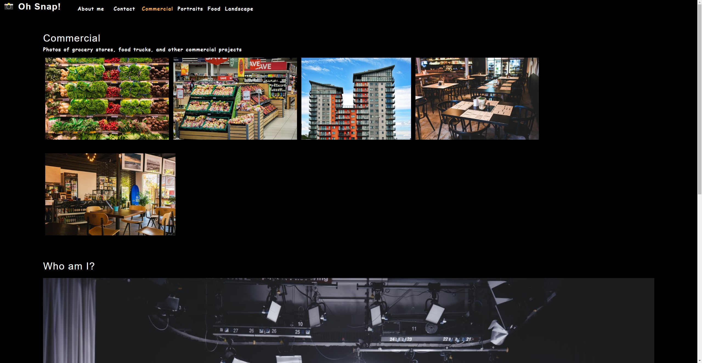

# Photo port

## Descripton
A react appication that allows the user to show off there work.  
https://chazgraham.github.io/photo-port/

## Table of Contents
  * [Installation Instructions](#installation-instructions)
  * [Application Usage](#application-usage)
  * [Contributors](#contributors)
  * [Licenses](#licenses)
  * [Tests](#tests)
  * [Contact Me](#contact-me)

## Installation Instructions
Before running this application you must install -please `npm install`, `npm install express`, `npm i mongoose`

## Application Usage
-A photo portfolio that showcases the users photos within diffrent settings.

## Contributors
By Chaz Graham

## Licenses
This application is licensed under: None

## Tests
To test application open the console and run the following comand: none

## Contact Me
If you have additional questions you can contact me at https://github.com/chazgraham